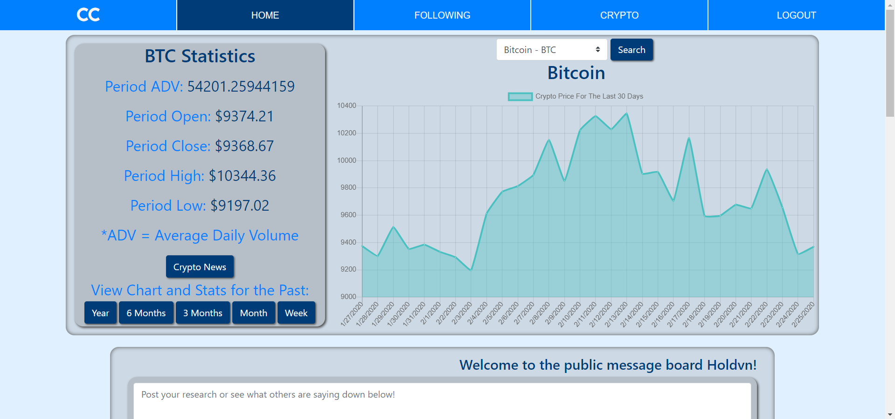

# Crypto Current

Crypto Current is a React application used to help assist beginners looking to invest in crypto currency have a place to go to make the right move. Using manipulated data from a third-party API and ChartJS, Crypto Current displays a line graph of popular crypto currencies (displaying Bitcoin by default) with corresponding statistics depending on the time increment selected to view. Using JSON as a local database users can post, edit, and delete their own messages on the public message board as well as follow users they find helpful. The "Following" page displays the usernames of who has been followed along with all their recent messages. Managing state with React hooks was paramount in making everything function fluidly. Lastly, the "Crypto" page allows the user to add cryptos to your watch-list as well as favorite or visit recommended crypto exchanges.

 

## Installation

Install react packages:

```bash
npm i
npm start
```

## Database sample
Create a json file with the provided sample data and run a json server on port 8088

```JSON
{
  "users": [
    {
      "id": 1,
      "username": "Holdvn",
      "email": "h@p.com",
      "password": "hp"
    },
    {
      "email": "s@t.com",
      "password": "st",
      "username": "STruett",
      "id": 2
    },
    {
      "email": "n@m.com",
      "password": "nm",
      "username": "NamitaIsAwesome",
      "id": 3
    },
    {
      "email": "a@b.com",
      "password": "ab",
      "username": "AudreyB",
      "id": 4
    },
    {
      "email": "c@m.com",
      "password": "cm",
      "username": "CoffeyDrinker",
      "id": 5
    },
    {
      "email": "j@n.com",
      "password": "jn",
      "username": "SlickBigMan",
      "id": 6
    },
    {
      "email": "S@t.com",
      "password": "st",
      "id": 7
    }
  ],
  "followers": [],
  "messages": [
    {
      "id": 9,
      "userId": 2,
      "message": "Bobby Lee says in an article that he thinks bitcoin will reach $1,000,000 one day!!!!",
      "timestamp": 1581199909288
    },
    {
      "id": 11,
      "userId": 1,
      "message": "Good article on how to get into investing in BTC on beincrypto.com!! #BuyCrypto",
      "timestamp": 1581352137442
    },
    {
      "id": 12,
      "userId": 3,
      "message": "Guys Ripple (XRP) is on the rise again, I would keep an eye on it and stay up to date with the news about it.",
      "timestamp": 1581355033853
    },
    {
      "id": 13,
      "userId": 4,
      "message": "Oh no guys! I've read that the devilish Coronavirus has been disrupting electronics manufacturing and could be bad news for crypto miners!!! Stack up on your cryptos while you still can!!!",
      "timestamp": 1581355102827
    },
    {
      "id": 14,
      "userId": 5,
      "message": "Litecoin seems to be on a pretty steady climb may be worth looking into and investing some money in!",
      "timestamp": 1581355166694
    },
    {
      "id": 15,
      "userId": 4,
      "message": "Ethereum is worth keeping an eye on with the recent surges in it's price! That crypto has potential!!!!",
      "timestamp": 1581367437655
    },
    {
      "id": 16,
      "userId": 3,
      "message": "Visa's transactions fees are rising while bitcoin transaction costs have remained stable! Another good reason to get into crypto!",
      "timestamp": 1581367450075
    },
    {
      "id": 17,
      "userId": 6,
      "message": "Man the whole crypto market has been killing it all of 2020! What a movement to be a part of! #StaySlick",
      "timestamp": 1581368461055
    },
    {
      "id": 18,
      "userId": 1,
      "message": "Tezos may be making a comeback! Get it while you still can!!!!",
      "timestamp": 1581615701705
    },
    {
      "id": 19,
      "userId": 1,
      "message": "Guys I read an article on beincrypto.com titled \"Ex-Coinbase CTO Argues Bitcoin Will Likely Hit $100,000 Using Coronavirus Spread Pattern\" what a read! and interesting comparison using the stochastic process! #BuyCrypto",
      "timestamp": 1581694083409
    },
    {
      "userId": 2,
      "message": "I wouldn't buy bitcoin until after this May and it's halving event is over.",
      "timestamp": 1582558638325,
      "id": 21
    },
    {
      "userId": 4,
      "message": "Some really interesting crypto debates on reddit! checkout r/CryptoCurrency if you get a chance.",
      "timestamp": 1582559467397,
      "id": 22
    }
  ],
  "cryptos": [
    {
      "id": 1,
      "crypto": "Bitcoin",
      "code": "BTC",
      "logo": "https://en.bitcoin.it/w/images/en/2/29/BC_Logo_.png"
    },
    {
      "id": 8,
      "crypto": "Bitcoin Cash",
      "code": "BCH",
      "logo": "https://i.redd.it/nus982esrz901.png"
    },
    {
      "id": 2,
      "crypto": "Ethereum",
      "code": "ETH",
      "logo": "https://getdrawings.com/vectors/ethereum-logo-vector-8.png"
    },
    {
      "id": 3,
      "crypto": "Ripple",
      "code": "XRP",
      "logo": "https://investinghaven.com/wp-content/uploads/2017/08/ripple.jpg"
    },
    {
      "id": 4,
      "crypto": "Litecoin",
      "code": "LTC",
      "logo": "data:image/png;base64,iVBORw0KGgoAAAANSUhEUgAAAOEAAADhCAMAAAAJbSJIAAAAgVBMVEU0XZ3///8rV5qBl74wWpxPcqotWZsmVZkhUphNcKkcUJclVJkYTpb6+/0STJX2+Ps7Y6GYqcnCzN+wvtbr7/WRpMbc4u2rudO7x9zm6vLR2ed0jbhGa6W1wdiersxaeKxshrSKnsLBy95hf7HW3eqDmL/L1ON5kLplgrJBZqKmtNCkNVstAAANJklEQVR4nN2d2ZaqOhCGASPEAII2zrbDdu73f8AjAgoIVEKq0HX+m732TcsnGar+VErD/L/L+PQDkIueMFosf/8ml8MgtLxhImGH/Wtv9Dc/RgH551MS+sff/W5gcOE6jm0zZrzEmG1bLhc87O9G8ynhQ1ARBtOf3m14R7PzXFVitsXFcLD/Xfg0j0JBOJ3tQuFaEFuB0+J8vfpZEDwNNmEw7jmeC7656rfpesbkjD0zUQmD+c7gVgu4F6UjwssY85kQCYPxbujaOnjZq+Sid8ablFiE033IEfBSWWI9ipCeDIXQn/c9pYUFFnOG1zPGs2EQBpuQ4+IlsvngR//p9AkXe8+h4IvFXGejPVg1CaOTo7V2gnKMkeb2oUUYnYa0fA9GsdFi1CD0RxY934MxnH2E8Md1OuG7i/GwfRTQlvDY513xJYzXtjFrO8Lg4lGtn3WyvFG7OKcV4dzoZgIW5a6XHRFG185fYCI2PLVYVdUJ5+wTLzCRczuSEwYr72N8dzFvQkx4vHW2RdSIbxXjODXC2fAzMzAvm6vtjUqEq073wFoJpZGqQLhYf3qEZuJXhTVVnnBp4+XwunJu8hGONOFMfH4KvsQcaQNAlnAkPg1VFONzXMLLlwHe5W0wCXffsYgWJbmkyhD6W/fTNJUSPSRCf/u5QLRZXAYRJvT7eNsgq1NbxBUCob9FA7T4rT+oVD9sOQ8k3iJIiDdE3V5DJDJu+RphRIhwh/cGm5/lt+VbFCM9wgveNmE1Zz1R25hQAPtiMyFiJMO2zQ/SmtDwmqObRsIZYiTjAq7uuP1o4Y0OVRPhEjNUGwLZwKn9isYaJ0AD4aLVaXzdU6ybAf2bxofZ64ZVuoFwjZkPOvtmwqnWeLF2bQhXqBk9B/K5jd6nNSyotYR/yOkE4Dv0NWdE/TdYR3gc4oClshuGUaxId8Awp+4rrCEMdCZ+hdzfZsK5dn5mH9QIV8gJkwBsXITP4zVTsZpwjmzdQwGNj/EhXnWJYyVh+wiqRg4QO54xYgu2rjxgrCS8Yif1LnBkNEHZmZxK46aK8Bf7eImFzYAm0ro2rBqnFYSBge39AqmhuUByulhfjvCCfjwBnRbNsD6R/8kQLvGPQF0goNmhrWwVu9I7oW789C4ooAnw7Fjr3Xx7I5zh29sOXfL7pvdsuEzoE9jbDpD89hA3JzaACHF2puKHAsmvGWLOC1F2bUqECwID3wL8vinqsGG3UmRTIuwRHGQLoJRJM/kti5dmfZFwgZsVpgLq0bbIi7fVRIg55zPZl2bACHvxdovbfoFwQVFsAR1Hz7EJWVgYNAXCEwUh4OajJ9v377RQ4p8nDChmYSfJb+kjC68t/58RxSt0K4LhvJYEJQIiH+nnCAPUnTeTBwQ0E4rFLT9ucoToUz4WGNDgB/p38VwqnCMcUHwW5OYvSMpV8yn3i3BK8lmQm4+W/BblvTaMF6HG8VaDGJD8HmjKAd3XhvEkpFlnwOSXqBwwt0c9Cf+RFHZBbj5m8lvQa615El5JhosHBDR7qnIr55myZYQk8QwY0GAZpVUqE7YtZ2mWAyW/dFcbvMxmzwhpBink5iMnv3lZmcWfEkY0owVy80kCmkRP/zslpFlJITc/oizrFNMC4YVkkEJuPkkknClLalJCmiJgyM2n+V5TZet4QqhXzVInKKAhSH7zGvo5wj+SNQ1y81Gryt6VBv0JIdFeAfQOokh+c0r3iwdhEFJ8Apj8rmlv4aQT8UFIMw2rj9VfIvEuC4qehDRpKOTmz6hvcSQP8CAkWrUBNx/v5LdGzt+TkOTvQ25+QD5IkwPhmJAmc4LcfLLkN6eMkGZfgtx8Gl+ooGGQEv5QTPnK2pa8SHyhosQxJSSxEhzAzcc9+a3WwyWKCUkimppKwacIk9+nHnb0ndCniC3AgIbIKC3oEfobRPm9tW8GDAqrG6PpNvVYC+6EC4qlFHLzc8mv7XrbvxEJYhg8CM8kZ05A8rtKBimzOLv+RhQnwbHc6EFIsVnY12bAR/LLLBH2xsHz//iKvRqDZlVzgW55S2477npyfP0f/xmMxCgyaLZDqDZ/P7z+5bcTomTY+XkQEkwB0M0/l74BktPZpILewK9JMmA3vyyak+AkCTdIzATIzS+LKhmOM7g7IcUAUQM0t0QBThzU3J8Ff8OHkt+yAqpEKl4P7oT4+S//p0ZIlgzHYRsJYe1NuRpRlEQ+FMf/FIRQQFOWT5YMs1tM6KMTQhfTCwr+Xeiy/fg6Egmh9C8BTP8OHLFJ9rtICJkLnfymY3N8urkYLc6bniVEn4e24/VHEq9wMdu5HLkFeIWwCW1uH2ZwIzX/PFk7TifN3zDXUuYI4/JPqmnjja4B+NtTJfuh/nbLXPc2WUo2wSWsoXl/sMODUPfPuGK7UfgdFZrz5mqlcalmbmH9qDUUJUjW6p+th5AfgsluSaQ1NGWl+aFejq8UwJjENTRlpTm+3oU8qBa/LNIamrLcxKfRmvrgEVNJfqc9QlOvTavwErpcWBZxDU1JqV+q5XlzRUeG4I5qg1LPW+/cokQAzUriGpqS0nOLSONPWKf84x9HIVBDM+30FWZnT76GHSueR0zBuBd61hAYtEQXSGqUnR9qnQEnjkz0c7XjZKh0ufFdNAV0dXpUZT3O8Vt/sVZsG043W5FmslBRMGL3BBm585Sw/Xbh/B73N/eVDEE2Ik2xda2etRhHjcVUFBJ1yEbsNKBJa2hjQjSnxoai8A5qaHJKGv8YmB8MReHHbgdpcrjwIMTynAWw35NcNK5X8oU/CJFO8t/7ipTUZfJrpAsNao0wVBQcdf0DLsGTEKmHIFRDQ1IhWK+0z2ASOeOU67KvCmiyo/aEEOWUuaJHU0EBwmeoKK0zT+/MYMwQqCiYpPaqQZ6ZIzQxxg//1I3YamWnmCkhQklybQPRTIQ3YquUhR8p4Vh/v4D6W3bp5sdyFwVChFUAOhft0s03ck515rPsdIcp2N+y44DmOaQyQm0rGioK7tTNN3J15hmhdgYl5IuCu1BchVEkzIp2W8v+ruT31droSajZyhe8EdvxT5q5z0TuSajVul+iKLjbn8TKFS29PGu9Ml0XagfV7V6RiyBfhFodBcELJDe79peQJKRO+Prk3LmDTpEndAS1WPc1tPYUHy2/deUIdWoghfpvvKooUvz283MmR6hx/wl083WlVmNbKI7Mn461jxwhN19fSi6El48+8oR+6xVdtSiYlrC47BVOOFv7mapFwepSmUBFs6FA2PY3EVRratSl4paXdq7iKXVLo0G1pkZdKpf3eLGDWpGw5b111ZoadSkkl+VEtVRp0Cq4At18ban0Gi5bfiXCVjdmITdfXwpnuG9fd7laZNPCG4bcfH0p7BVe+WHebii1CHMt4oDG9OXXmfdD2jdCdbcBcvP1peCW8zfH7/2WmXKKwYH+lvqSX/+KFUw1hFPVHcNVqxFuIfnWfNZ7cFVxU3CvttjQBzTyhXeiYjhVECo6NpCbry/pUrHKo5Oq255npXGqWn+pLukWGpW/BFp5n/WiEAWCbr62pNstVf0WUg2hStfkitULWbJ7RU29UvWdZIVxCvW31Jfs2WbNCW3NrWv59RRy8/UlaR+JGk+67l55X3J2Q26+viSLfay6++N1hLJdDiA3X19yJ5v1bl9tbwDJ+NQhDmiCk9x8cWpPoOu7H0hOxVOPUqtQbpnx6odSQ38HuRDctkglxWc4DVtWA2HUbb2rhhord5t6dHTRNA5DLGzasRq7kPzr9lizpZjVWOfS3Gdl1nVFaBsBnWCBTjKT73+LVTmhAqG577igUFkC8tvBbkCr715uBHj/Ee539NWIMKAEoXn9XkQh4bbL9Kz62rco8QblCM3Vdy43ntQdZLm+Y/tv3DQ8uVNLyc5qo6/b+pknabXL9o77+bK3yBygp70yoTl2vynTsEPpbiry/f8WksloF3K38v6XQofD4PAtS6qnUqCk1MNx8hWIzFFyv9S6VI5Fx6W+FbIMtYMSxT6c0fbTr1GsFM/UVTuNmhPvk2uqXedsIxKax1u3Bc158a26PatOaAb74Wdeoz0Efm8Bi9A0l4NPZBvi0Kq4rBWh6Y86X1QttT1Cl/C+qO54l0PVdk9tT/HaEprm+dYZI/O2Ck390Ajv+UbYyXRkfKBzzqxDaAZ/nJyRcUOv5kqL8L7kbAxSRsbXukewmoTxe7TJ5qMtbnPtukdtwrvmW5Jux457xShcxSC8hwCrIbIFYHOxb79+5oVDGA/WPkeLV5nDD2glnViEdx0nlkBo78wsL9wgFv8jEt613K+FVhtk2+FS3bIVhEt43z6mm8GwXaduZnFPplu2orAJYwXj/dYSSh27LUew7eRMURJPQRgrOm+ujsddy25+ncy2XDE0Vn9LqtIjKsKHovPsdBgYQnDXsSw7u9B7/9e2Lcfhwg371/3vkrT4j5TwIT9aLOezzX516K/D+ztjRrjuX1f7zezfMSIvbOyC8NP6/xP+BxEZxgAhstXnAAAAAElFTkSuQmCC"
    },
    {
      "id": 5,
      "crypto": "Tezos",
      "code": "XTZ",
      "logo": "https://cdn.worldvectorlogo.com/logos/tezos-1.svg"
    },
    {
      "id": 6,
      "crypto": "Monero",
      "code": "XMR",
      "logo": "https://web.getmonero.org/press-kit/symbols/monero-symbol-480.png"
    },
    {
      "id": 7,
      "crypto": "Stellar Lumens",
      "code": "XLM",
      "logo": "https://media.glassdoor.com/sqll/955554/stellar-development-foundation-squarelogo-1570473121446.png"
    }
  ],
  "favoriteCryptos": [],
  "markets": [
    {
      "id": 1,
      "name": "Binance",
      "url": "https://www.binance.us/en",
      "logo": "https://globalcoinresearch.com/wp-content/uploads/2019/12/1_qJyrPq9RD2AjfZ_MWEtzMQ.png",
      "description": "Offers mobile app and the world’s largest exchange. If you need to pick only one, this is the best and #1 in 2020. Offers max number of cryptos, basic and advanced trading."
    },
    {
      "id": 2,
      "name": "Bybit",
      "url": "https://www.bybit.com/en-US/",
      "logo": "https://cdn-images-1.medium.com/max/1200/1*kCLLfpTF5F-UkRGCy-uxDg.png",
      "description": "Very popular with high volume. Idle for margin trading."
    },
    {
      "id": 3,
      "name": "Coinmama",
      "url": "https://www.coinmama.com/",
      "logo": "https://boinnex.com/wp-content/uploads/2019/11/Coinmama2-271x300.png",
      "description": "Old but gold and lets you buy BTC and ETH instantly."
    },
    {
      "id": 4,
      "name": "CoinBase",
      "url": "https://www.coinbase.com/",
      "logo": "https://www.trustedcryptos.com/wp-content/uploads/2019/07/coinbase-logo.jpg",
      "description": "A U.S.A. regulated exchange based out of California."
    },
    {
      "id": 5,
      "name": "ChangeNow",
      "url": "https://changenow.io/",
      "logo": "https://www.coinchoose.com/wp-content/uploads/2018/10/changenow-header.jpg",
      "description": "Instantly convert any cryptocurrency to any of your choices. Great for instant conversion."
    },
    {
      "id": 6,
      "name": "KuCoin",
      "url": "https://www.kucoin.com/",
      "logo": "https://mk0cryptoreviewa20te.kinstacdn.com/wp-content/uploads/2018/10/KuCoin-logo-800x429.png",
      "description": "One of the strongest exchanges that also offers a mobile app. They have been constantly updating their mobile apps to make it one of the best in the industry."
    },
    {
      "id": 7,
      "name": "Bittrex",
      "url": "https://bittrex.com/",
      "logo": "https://totalcrypto.io/wp-content/uploads/2018/11/BittrexLogo_Color-740x492.jpg",
      "description": "Another high-quality exchange with a lot of coins."
    },
    {
      "id": 8,
      "name": "Cex",
      "url": "https://cex.io/",
      "logo": "https://bestbitcoinexchange.com/wp-content/uploads/2017/07/bestbitcoinexchange-cex-logo.png",
      "description": "Simple and easy to use."
    }
  ],
  "favoriteMarkets": []
}

```
## Usage

1. Get a API key from alphavantage.co and place it in the designated spot in the .env.local file.
2. Click on "Not a member yet?" on the login page to make a new account.
3. After creating an account it will log you into the home page.
4. On the Home page you'll be able to view different crypto charts as well as post on the public message board.
5. On the Following page you can view users you've followed and their recent posts
6. On the Crypto page you can add cryptos to your watchlist and favorite or visit reccomended crypto markets.
